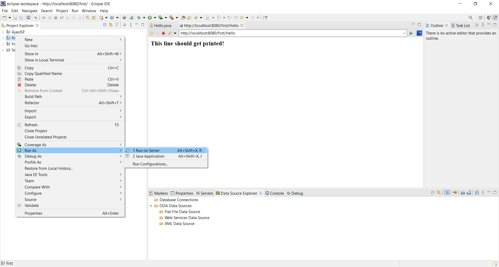

<h1 align="center">Creating Java Servlet in Eclipse</h1>


<br />
<p align="center">
  <a href="https://www.eclipse.org/">
    
  </a>

  

  <p align="center">
    A program to understand how Java Servlet works! 
    <br />
    <a href="https://tomcat.apache.org/tomcat-5.5-doc/servletapi/"><strong>Explore the docs »</strong></a>
    <br />
    <br />
    <a href="#">View Demo</a>
    ·
    <a href="https://github.com/shahkv95/JavaServlet/issues">Report Bug</a>
    ·
    <a href="https://github.com/shahkv95/JavaServlet/issues">Request Feature</a>
  </p>
</p>

[![Tomcat][dependencies_ts]][dependencies_ts-url]
[![Oracle JDK][dependencies_jdk]][dependencies_jdk-url]
[![Eclipse][dependencies_ecl]][dependencies_ecl-url]
[![MIT License][license-shield]][license-url]
[![LinkedIn][linkedin-shield]][linkedin-url]

<!-- TABLE OF CONTENTS -->
## Table of Contents

* [About the Project](#about-the-project)
* [Built With](#built-with)
* [Getting Started](#getting-started)
* [Creating the Project from scratch](#creating-the-project-from-scratch)
* [Directly running this project](#directly-running-this-project)
* [Roadmap](#roadmap)
* [Contributing](#contributing)
* [License](#license)
* [Contact](#contact)


<!-- ABOUT THE PROJECT -->
## About The Project



The servlets provide an object-based, independent, web-based application building platform, without the limitations of CGI programs. Servlets have access to the entire Java APIs family, including the JDBC API to access business information. This project is mainly focused to understand how to use Java resources to improve our web-based applications in simple and easy steps.

Applications of this project with certain extensions:

* Read clear data sent to clients (browsers). This includes data that can come from HTTP client system or an applet or the HTML form on a Web page.

* Read the requested HTTP request data sent to clients (browsers). This includes cookies, media types and so on.

* Process data and create results. This process may require database communication, making an RMI, installing a Web service, or entering a direct response to a computer.

* Send explicit data (e.g., documents) to customers (browsers). This text can be exported in a variety of ways, including text (HTML or XML), binary (GIF images), Excel, etc.

* Send anonymous HTTP response to customers (browsers). This includes telling browsers or other clients what type of document is being returned (e.g., HTML), setting cookies and cache restrictions, and other such functions.


### Built With
This project was built using the following tools/frameworks:

* [Apache Tomcat](http://tomcat.apache.org/)
* [Eclipse IDE](https://www.eclipse.org/downloads/packages/release/helios/sr1/eclipse-ide-java-developers)
* [Oracle Java Development Kit](https://www.oracle.com/in/java/technologies/javase/javase-jdk8-downloads.html)


### Getting Started

To run the project successfully, you need to download and install the three tools/frameworks mentioned before. For ease of access, follow the below steps to complete the process easily.
* Apache Tomcat

> 1. Go to [Apache Tomcat](http://tomcat.apache.org/)
> 2. Download the latest stable version of Apache Tomcat Server. For this project, I have used [Apache Tomcat v9.0 Download](https://tomcat.apache.org/download-90.cgi)
> 3. When you are on this page - [Apache Tomcat v9.0 Download](https://tomcat.apache.org/download-90.cgi), download <b>apache-tomcat-9.0.39-windows-x64</b> by clicking on the option </b>64-bit Windows zip (pgp, sha512)</b>
> 4. Extract the files/ folders present in_ the downloaded files
> 5. Open the extracted folder(<b>apache-tomcat-9.0.39</b>). Go to bin and install the <b>tomcat9 application</b>


* Eclipse IDE

> 1. Go to [Eclipse IDE Download](https://www.eclipse.org/downloads/packages/release/helios/sr1/eclipse-ide-java-developers)
> 2. Download the latest stable version of Eclipse IDE. For this project, I have used [Eclipse Installer 2020-09 R](https://www.eclipse.org/downloads/download.php?file=/oomph/epp/2020-09/R/eclipse-inst-jre-win64.exe)
> 3. On downloading the installer, extract if_ a zip file is downloaded
> 4. Double click on the installer and install the <b>Eclipse IDE for Enterprise Java Developers</b>
> 5. Accept the required permission(after you agree to them by going through the terms and conditions) and finish the process to successfully install the IDE


* Oracle Java Development Kit

> 1. Go to [Oracle JDK 8 Download](https://www.oracle.com/in/java/technologies/javase/javase-jdk8-downloads.html)
> 2. Download the latest stable version of Oracle JDK. For this project, I have used Oracle JDK 8(<b>jdk-8u271-windows-x64.exe</b>). Before downloading you have to first create your account on the site and then click on the favorable installer
> 3. On downloading the installer, extract if_ a zip file is downloaded
> 4. Double click on the installer and install the <b>jdk-8u261-windows-x64</b> jdk8
> 5. Accept the required permission(after you agree to them by going through the terms and conditions) and finish the process to successfully install the IDE


### Creating the Project from scratch

#### Brief introduction of the process
* Create a Dynamic web project
* Create a servlet
* Add servlet-api.jar file
* Write the servlet code
* Configure the server
* Run the servlet

#### Detailed steps to follow
1. Creating a Dynamic web project
```md
1.1 Open Eclipse
1.2 File --> New --> Dynamic Web Project
1.3 Enter project_name --> Chose target runtime(Apache Tomcat v9.0 or the version you installed) --> Next --> Next 
1.4 Check the checkbox of Generate web.xml deployment descriptor --> Finish
1.5 You will see the message - "Installing Dynamic Web Module Facet..." 
1.6 On completion you can see your project folder created under the "Project Explorer" view frame.
```


2. Creating a servlet in Eclipse
```md
2.1 Right click on the project name
2.2 Click on New --> Servlet
2.3 Enter the class name(say "MyServlet") --> Next --> Next
2.4 Uncheck the methods that are not required and check the method names that you require in your project/java file --> Finish
2.5 "MyServlet.java" file will be created with the basic template. Now you can write your own code here. 
```


3. Adding servlet-api.jar file
```md
3.1 Right click on the project name
3.2 Click on Build Path --> Configure build path
3.3 Under the <b>Libraries</b> tab, click on <b>Add External JARs</b> present in the right columnar frame
3.4 Browse and open the Tomcat folder that you downloaded --> lib folder --> select servlet-api.jar file --> Open --> Apply and Close
3.5 The required servlet api file would be added 
```


4. Writing the servlet code in Eclipse
```md
4.1 Your program will still run with this basic template 
4.2 You can write your own code in the java file
4.3 For simplicity you can consider this code for ease of understanding
```
```java
 


import java.io.IOException;
import java.io.PrintWriter;
import javax.servlet.ServletException;
import javax.servlet.annotation.WebServlet;
import javax.servlet.http.HttpServlet;
import javax.servlet.http.HttpServletRequest;
import javax.servlet.http.HttpServletResponse;

/**
 * Servlet implementation class MyServlet
 */
@WebServlet("/MyServlet")
public class MyServlet extends HttpServlet {
	private static final long serialVersionUID = 1L;
       
    /**
     * @see HttpServlet#HttpServlet()
     */
    public MyServlet() {
        super();
        // TODO Auto-generated constructor stub
    }

	/**
	 * @see HttpServlet#doGet(HttpServletRequest request, HttpServletResponse response)
	 */
	protected void doGet(HttpServletRequest request, HttpServletResponse response) throws ServletException, IOException {
		// TODO Auto-generated method stub
		response.getWriter().append("Served at: ").append(request.getContextPath());
		response.setContentType("text/html");
		PrintWriter output=response.getWriter();
		
		output.print("<html><body>");
		output.print("<h3>Hi! This is Kush Shah.</h3>");
		output.print("<h3>And this output verifies that we have successfully deployed the servlet on tomcat v9.0 server.</h3>");
		output.print("</body></html>");
	}

	/**
	 * @see HttpServlet#doPost(HttpServletRequest request, HttpServletResponse response)
	 */
	protected void doPost(HttpServletRequest request, HttpServletResponse response) throws ServletException, IOException {
		// TODO Auto-generated method stub
		doGet(request, response);
	}

}


```
```md
4.4 Ctrl+S to save the code
```

5. Configuring the server
```md
5.1 Right click in the blank area under the server tab in the pane present below the code area.
5.2 Click on New --> Server
5.3 Select the server you installed(I chose Tomcat v9.0 Server) under the server type --> Next
5.4 Click on Add All --> Finish
5.5 The required server is configured and ready to host a program 
```


6. Running the servlet
```md
6.1 Right click on the project name
6.2 Select Run As --> 1 Run on Server
6.3 Select <b>Choose an existing server</b> --> select the Tomcat server under the localhost folder --> Next
6.4 Click on Add All --> Finish
6.5 You will encounter <b>HTTP Status 404 – Not Found</b>. Dont worry. It is because the local address is just accessing the folder and not the java file.
6.6 To solve this issue, typw the name of the file after the '/'. So at the end it will look like --> <b>http://localhost:8080/understanding/file_name</b>
6.7 Press Enter and you will be able to see the desired output...!
```


### Directly running this project

##### It is assumed that before running the project you have the already created the required local environment.
> 1. Download the zip file of this project from the <b>Code</b> button of the project
> 2. Extract the files
> 3. Open the Eclipse IDE
> 4. Go to File --> Import 
> 5. Open the dropdown of General folder --> Existing Projects into Workspace --> Next 
> 6. Browse and select the downloaded and extracted folder of this project --> Check the option "Copy projects into workspace" --> Finish
> 7. Your complete project would be ready to be deployed on the server.
> 8. Right click on the project and follow the above step #6

### Yes We Did It


<!-- ROADMAP -->
## Roadmap

See the [open issues](https://github.com/shahkv95/JavaServlet/issues) for a list of proposed features (and known issues).


<!-- CONTRIBUTING -->
## Contributing

If you like the project then kindly give a star to the repo. Any contributions you make are **greatly appreciated**.

1. Fork the Project
2. Create your Feature Branch (`git checkout -b feature/AmazingFeature`)
3. Commit your Changes (`git commit -m 'Add some AmazingFeature'`)
4. Push to the Branch (`git push origin feature/AmazingFeature`)
5. Open a Pull Request


<!-- LICENSE -->
## License

Distributed under the MIT License. See `LICENSE` for more information.


<!-- CONTACT -->
## Contact

[Kush Shah](https://www.linkedin.com/in/kush-shah-5a771b169/)

Project Link: [Java Servlet](https://github.com/shahkv95/JavaServlet)


[dependencies_ts]: https://img.shields.io/badge/TomcatServer-v9.0-blue
[dependencies_ts-url]: https://tomcat.apache.org/download-90.cgi

[dependencies_jdk]: https://img.shields.io/badge/Oracle%20JDK-SE%208-orange
[dependencies_jdk-url]: https://www.oracle.com/in/java/technologies/javase/javase-jdk8-downloads.html

[dependencies_ecl]: https://img.shields.io/badge/Eclipse-2020--09-brightgreen
[dependencies_ecl-url]: https://www.eclipse.org/downloads/packages/release/helios/sr1/eclipse-ide-java-developers

[license-shield]: https://img.shields.io/badge/license-MIT-ff69b4
[license-url]: https://raw.githubusercontent.com/shahkv95/JavaServlet/main/LICENSE

[linkedin-shield]: https://img.shields.io/badge/-LinkedIn-black.svg?style=flat-square&logo=linkedin&colorB=555
[linkedin-url]: https://www.linkedin.com/in/kush-shah-5a771b169/
[product-screenshot]: images/click.png

### Time To Celebrate It


