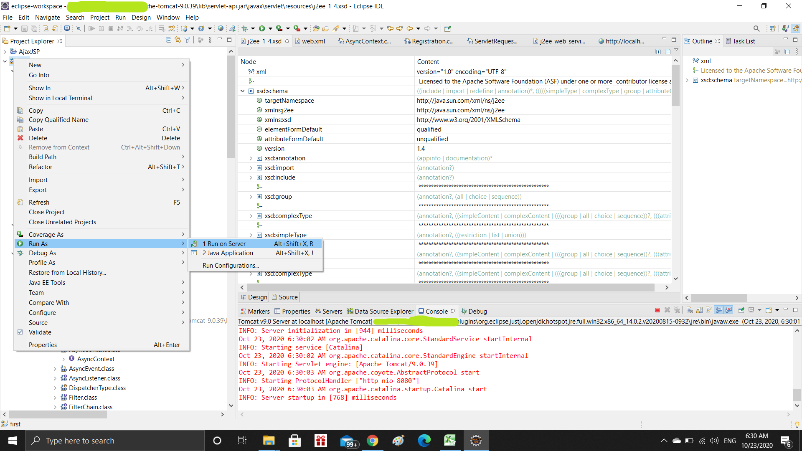

<!-- PROJECT SHIELDS -->
<!--
*** I'm using markdown "reference style" links for readability.
*** Reference links are enclosed in brackets [ ] instead of parentheses ( ).
*** See the bottom of this document for the declaration of the reference variables
*** for contributors-url, forks-url, etc. This is an optional, concise syntax you may use.
*** https://www.markdownguide.org/basic-syntax/#reference-style-links
-->

<h1 align="center">Creating Java Servlet in Eclipse</h1>


<br />
<p align="center">
  <a href="https://github.com/othneildrew/Best-README-Template">
    
  </a>

  

  <p align="center">
    A program to understand how Java Servlet works! 
    <br />
    <a href="https://github.com/othneildrew/Best-README-Template"><strong>Explore the docs »</strong></a>
    <br />
    <br />
    <a href="https://github.com/othneildrew/Best-README-Template">View Demo</a>
    ·
    <a href="https://github.com/shahkv95/JavaServlet/issues">Report Bug</a>
    ·
    <a href="https://github.com/shahkv95/JavaServlet/issues">Request Feature</a>
  </p>
</p>


<!-- TABLE OF CONTENTS -->
## Table of Contents

* [About the Project](#about-the-project)
  * [Built With](#built-with)
* [Getting Started](#getting-started)
  * [Prerequisites](#prerequisites)
  * [Installation](#installation)
* [Usage](#usage)
* [Roadmap](#roadmap)
* [Contributing](#contributing)
* [License](#license)
* [Contact](#contact)
* [Acknowledgements](#acknowledgements)


<!-- ABOUT THE PROJECT -->
## About The Project



There are many great README templates available on GitHub, however, I didn't find one that really suit my needs so I created this enhanced one. I want to create a README template so amazing that it'll be the last one you ever need.

Here's why:
* Your time should be focused on creating something amazing. A project that solves a problem and helps others
* You shouldn't be doing the same tasks over and over like creating a README from scratch
* You should element DRY principles to the rest of your life :smile:

Of course, no one template will serve all projects since your needs may be different. So I'll be adding more in the near future. You may also suggest changes by forking this repo and creating a pull request or opening an issue.

A list of commonly used resources that I find helpful are listed in the acknowledgements.

### Built With
This project was built using the following tools/frameworks:

* [Apache Tomcat](http://tomcat.apache.org/)
* [Eclipse IDE](https://www.eclipse.org/downloads/packages/release/helios/sr1/eclipse-ide-java-developers)
* [Oracle Java Development Kit](https://www.oracle.com/in/java/technologies/javase/javase-jdk8-downloads.html)


<!-- GETTING STARTED -->
## Getting Started

To get a local copy up and running follow these simple example steps.

### Pre-requisites

This is an example of how to list things you need to use the software and how to install them.
* Apache Tomcat
```sh
1. Go to http://tomcat.apache.org/
2. Download the latest stable version of Apache Tomcat Server. For this project, I have used Tomcat 9.0(https://tomcat.apache.org/download-90.cgi)
3. When you are on this page - (https://tomcat.apache.org/download-90.cgi), download "apache-tomcat-9.0.39-windows-x64" by clicking on the option "64-bit Windows zip (pgp, sha512)"
4. Extract the files/ folders present in_ the downloaded files
5. Open the extracted folder(apache-tomcat-9.0.39). Go to bin and install the tomcat9 application
```

* Eclipse IDE
```sh
1. Go to https://www.eclipse.org/downloads/packages/release/helios/sr1/eclipse-ide-java-developers
2. Download the latest stable version of Eclipse IDE. For this project, I have used Eclipse Installer 2020-09 R(https://www.eclipse.org/downloads/download.php?file=/oomph/epp/2020-09/R/eclipse-inst-jre-win64.exe)
3. On downloading the installer, extract if_ a zip file is downloaded
4. Double click on the installer and install the Eclipse IDE for_ Enterprise Java Developers
5. Accept the required permission(after you agree to them by going through the terms and conditions) and finish the process to successfully install the IDE
```

* Oracle Java Development Kit

> 1. Go to https://www.oracle.com/in/java/technologies/javase/javase-jdk8-downloads.html
> 2. Download the latest stable version of Oracle JDK. For this project, I have used Oracle JDK 8(jdk-8u271-windows-x64.exe). Before downloading you have to first create your account on the site and then click on the favorable installer
> 3. On downloading the installer, extract if_ a zip file is downloaded
> 4. Double click on the installer and install the jdk-8u261-windows-x64 jdk8
> 5. Accept the required permission(after you agree to them by going through the terms and conditions) and finish the process to successfully install the IDE


### Locally running the Project

#### Brief introduction of the process
* Create a Dynamic web project
* Create a servlet
* Add servlet-api.jar file
* Run the servlet

#### Detailed steps to follow
1. Creating a Dynamic web project
```md
1.1 Open Eclipse
1.2 File --> New --> Dynamic Web Project
1.3 Enter project_name --> Chose target runtime(Apache Tomcat v9.0 or the version you installed) --> Next --> Next 
1.4 Check the checkbox of Generate web.xml deployment descriptor --> Finish
1.5 You will see the message - "Installing Dynamic Web Module Facet..." 
1.6 On completion you can see your project folder created under the "Project Explorer" view frame.
```

2. Creating a servlet in Eclipse
```JS
const API_KEY = 'ENTER YOUR API';
```


<!-- USAGE EXAMPLES -->
## Usage

Use this space to show useful examples of how a project can be used. Additional screenshots, code examples and demos work well in this space. You may also link to more resources.

_For more examples, please refer to the [Documentation](https://example.com)_


<!-- ROADMAP -->
## Roadmap

See the [open issues](https://github.com/othneildrew/Best-README-Template/issues) for a list of proposed features (and known issues).


<!-- CONTRIBUTING -->
## Contributing

Contributions are what make the open source community such an amazing place to be learn, inspire, and create. Any contributions you make are **greatly appreciated**.

1. Fork the Project
2. Create your Feature Branch (`git checkout -b feature/AmazingFeature`)
3. Commit your Changes (`git commit -m 'Add some AmazingFeature'`)
4. Push to the Branch (`git push origin feature/AmazingFeature`)
5. Open a Pull Request


<!-- LICENSE -->
## License

Distributed under the MIT License. See `LICENSE` for more information.


<!-- CONTACT -->
## Contact

Kush Shah - [Kaggle_Profile](https://www.kaggle.com/kushshah95) - [email](kushlinkedin@gmail.com)  

Project Link: [Java Servlet](https://github.com/shahkv95/JavaServlet)


<!-- ACKNOWLEDGEMENTS -->
## Acknowledgements
* [GitHub Emoji Cheat Sheet](https://www.webpagefx.com/tools/emoji-cheat-sheet)
* [Img Shields](https://shields.io)
* [Choose an Open Source License](https://choosealicense.com)
* [GitHub Pages](https://pages.github.com)
* [Animate.css](https://daneden.github.io/animate.css)
* [Loaders.css](https://connoratherton.com/loaders)
* [Slick Carousel](https://kenwheeler.github.io/slick)
* [Smooth Scroll](https://github.com/cferdinandi/smooth-scroll)
* [Sticky Kit](http://leafo.net/sticky-kit)
* [JVectorMap](http://jvectormap.com)
* [Font Awesome](https://fontawesome.com)


<!-- MARKDOWN LINKS & IMAGES -->
<!-- https://www.markdownguide.org/basic-syntax/#reference-style-links -->
[contributors-shield]: https://img.shields.io/github/contributors/othneildrew/Best-README-Template.svg?style=flat-square
[contributors-url]: https://github.com/othneildrew/Best-README-Template/graphs/contributors
[forks-shield]: https://img.shields.io/github/forks/othneildrew/Best-README-Template.svg?style=flat-square
[forks-url]: https://github.com/othneildrew/Best-README-Template/network/members
[stars-shield]: https://img.shields.io/github/stars/othneildrew/Best-README-Template.svg?style=flat-square
[stars-url]: https://github.com/othneildrew/Best-README-Template/stargazers
[issues-shield]: https://img.shields.io/github/issues/othneildrew/Best-README-Template.svg?style=flat-square
[issues-url]: https://github.com/othneildrew/Best-README-Template/issues
[license-shield]: https://img.shields.io/github/license/othneildrew/Best-README-Template.svg?style=flat-square
[license-url]: https://github.com/othneildrew/Best-README-Template/blob/master/LICENSE.txt
[linkedin-shield]: https://img.shields.io/badge/-LinkedIn-black.svg?style=flat-square&logo=linkedin&colorB=555
[linkedin-url]: https://www.linkedin.com/in/kush-shah-5a771b169/
[product-screenshot]: images/click.png
